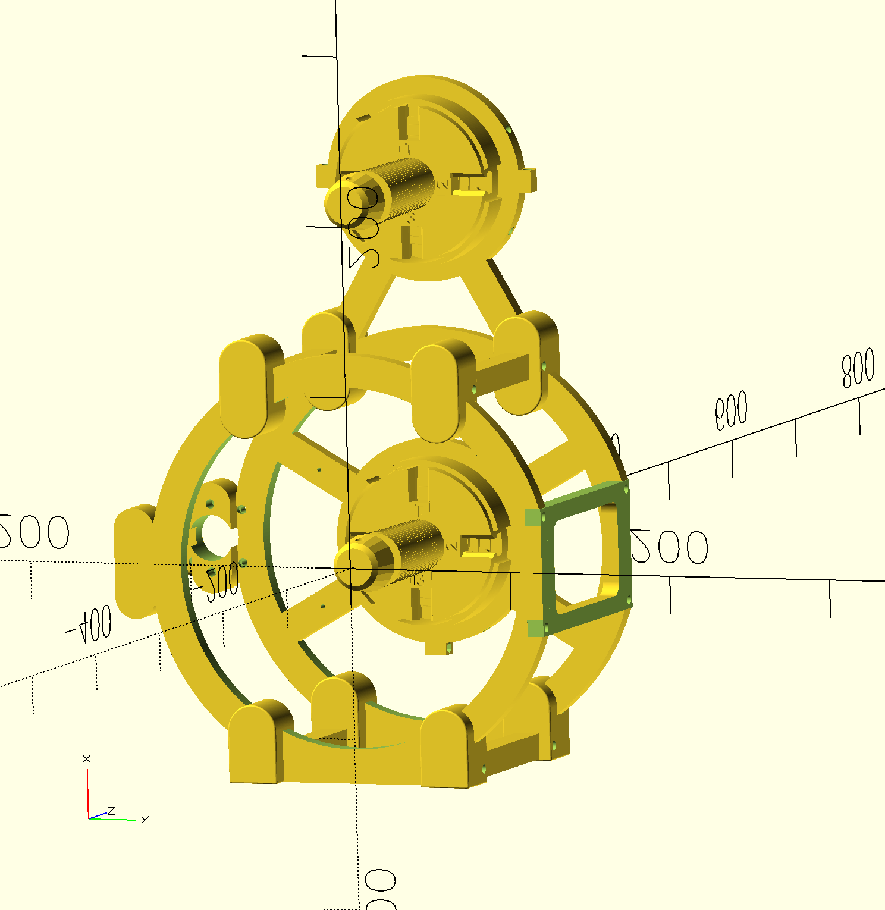
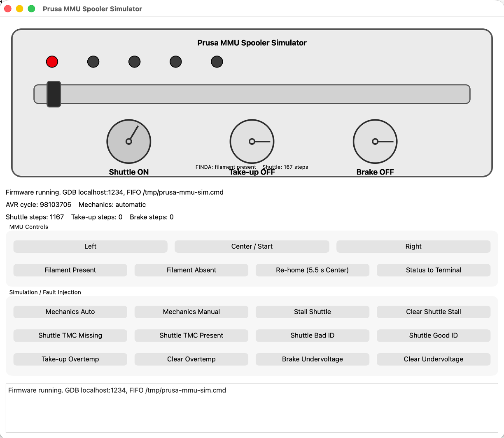

# Prusa MMU Spooler Development Environment



## Introduction
This software project supports the development and operation of a 3D-printable filament rewinder. A filament rewinder is used to transfer the remaining filament from a partially used spool onto another spool. While the basic concept is simple, the filament must be wound in a controlled and even manner so that each layer lays flat across the pickup spool rather than bunching, crossing, or building up unevenly.

The project was conceived to solve a specific problem faced by Prusa printer owners who have an existing MMU2 or MMU3 and are upgrading to the newer INDX system. After the upgrade, the MMU assembly may no longer be needed for its original purpose, but it still contains a capable controller, stepper motors, drivers, sensors, and other useful hardware. Rather than discard or store these components, this project repurposes them as the foundation of a computer-controlled filament rewinder.

The rewinder is designed to make maximum use of the existing Prusa MMU2/MMU3 hardware. The motors, controller electronics, sensors, and related components are reused, while the mechanical structure is provided by a purpose-built 3D-printable design. No additional drive motors or separate motion-control electronics are required.

The resulting system provides an automated way to recover and reorganize leftover filament while giving otherwise unused MMU hardware a useful second life. The software in this repository controls the rewinding process, coordinates the spool and filament-guiding mechanisms, manages sensors and operator controls, and supports development and testing of the rewinder hardware.

This directory contains the complete development environment for the Prusa MMU-based filament spool rewinder project.

The project is divided into three separate directories:

```text
PrusaMMUFirmware/
├── simavr/
├── Prusa-MMU-Simulator/
└── Spooler-Firmware/
```

Each directory has a different purpose and is built independently.

## Directory Overview

### `Spooler-Firmware`

This directory contains the actual firmware that runs on the ATmega32U4 processor on the Prusa MMU controller board. 

The firmware implements the filament rewinder application, including:

- Shuttle/traverse motor control
- Take-up spool motor control
- Supply spool braking and tension
- TMC2130 stepper-driver configuration
- FINDA filament detection
- MMU front-panel button handling
- LED status indication
- Shuttle homing using TMC2130 StallGuard
- Adjustable outer winding limit
- Pause and resume operation
- Filament runout handling
- Manual shuttle re-homing
- EEPROM storage of configuration information
- Debug UART output when `SPOOLER_DEBUG` is enabled

The firmware is cross-compiled for the ATmega32U4 using the AVR GCC toolchain.

The current development environment uses the AVR tools installed under:

```text
/opt/local/bin/
```

```text
sudo port selfupdate
sudo port install avr-gcc avr-binutils avr-libc
```

If you don't have mac port then you can install it from here: https://www.macports.org/install.php

Typical tools include:

```text
avr-gcc
avr-g++
avr-objcopy
avr-objdump
avr-size
```

A normal Release build is created with:

```bash
cd Spooler-Firmware

cmake -S . -B build/release -G Ninja \
  -DCMAKE_TOOLCHAIN_FILE=cmake/AvrGcc.cmake \
  -DCMAKE_BUILD_TYPE=Release

cmake --build build/release
```

The resulting firmware ELF is:

```text
Spooler-Firmware/build/release/firmware
```

A Debug build is created with:

```bash
cmake -S . -B build/debug -G Ninja \
  -DCMAKE_TOOLCHAIN_FILE=cmake/AvrGcc.cmake \
  -DCMAKE_BUILD_TYPE=Debug

cmake --build build/debug
```

The Debug ELF is:

```text
Spooler-Firmware/build/debug/firmware
```

The Debug configuration defines:

```text
SPOOLER_DEBUG
```

which enables firmware diagnostic messages sent through the simulated or physical UART.

---

### `Prusa-MMU-Simulator`

This directory contains the host-side simulator used to test the spooler firmware without requiring the physical Prusa MMU controller.

The simulator is a native macOS C++ application. It does **not** run on the AVR processor.

It uses `simavr` to emulate the ATmega32U4 and adds models for the external MMU hardware that the spooler firmware expects to see.

The simulator models such functions as:

- ATmega32U4 execution
- TMC2130 SPI communications
- Stepper motors
- Shuttle mechanical position
- Shuttle end stops
- StallGuard behavior
- FINDA filament sensor
- MMU push buttons
- LED shift registers
- Take-up motor
- Brake motor
- Automatic filament runout
- TMC2130 fault conditions
- UART debug output

####Prusa MMU Simulator GUI

The Prusa MMU Simulator GUI provides a visual environment for running and testing the rewinder firmware without requiring the physical MMU2/MMU3 hardware. It works with the simavr AVR emulator to execute the same ATmega32U4 firmware used by the real rewinder while presenting the major motors, sensors, controls, and operating status in a single graphical interface.



The upper portion of the window provides a simplified representation of the rewinder hardware. It shows the shuttle position, the state of the five MMU LEDs, and the operating state of the three stepper-motor functions: the shuttle, take-up spool, and brake. As the firmware runs, these indicators are updated from the simulated hardware so that movement and motor activity can be observed directly.

The control section allows the user to interact with the firmware in much the same way as the physical MMU. The Left, Center, and Right buttons simulate the MMU front-panel controls, while additional controls allow filament presence to be changed, a long center-button press to be generated for re-homing, and simulator status to be displayed. This makes it possible to exercise normal rewinder operations such as homing, starting and stopping winding, changing operating modes, and responding to filament runout.

The simulator also includes a set of fault-injection controls intended for development and verification. These controls can switch between automatic and manual mechanics, force a shuttle stall, remove or restore a simulated TMC2130 driver, inject an invalid driver ID, and simulate conditions such as over-temperature and undervoltage. These capabilities make it possible to test firmware error handling and recovery paths that would otherwise be difficult or inconvenient to reproduce with the physical hardware.

Runtime information is displayed beneath the graphical MMU, including the AVR cycle count, simulated motor step counts, shuttle position, FINDA state, mechanics mode, GDB connection information, and the command FIFO used for scripted control. A log window at the bottom of the interface provides additional simulator messages and diagnostic information.

The simulator can be used in two primary modes. For normal functional testing, the firmware can be started immediately and controlled entirely through the GUI. For firmware development, the simulator can be started in GDB mode, allowing Visual Studio Code and avr-gdb to connect to the simulated ATmega32U4 so that breakpoints, single stepping, variable inspection, and other source-level debugging operations can be performed while the GUI continues to represent the simulated rewinder hardware.

To run the gui based simulator without using VSCode:
```text
./build/Prusa-MMU-Simulator/debug/prusa_mmu_sim_gui build/Spooler-Firmware/debug/firmware
```

The simulator also provides a command interface using:

```text
/tmp/prusa-mmu-sim.cmd
```

For example:

```bash
echo 'status' > /tmp/prusa-mmu-sim.cmd
```

Simulate filament being installed:

```bash
echo 'filament present' > /tmp/prusa-mmu-sim.cmd
```

Simulate a center-button press:

```bash
echo 'tap middle 500' > /tmp/prusa-mmu-sim.cmd
```

The simulator is built as a native macOS program:

```bash
cd Prusa-MMU-Simulator

cmake -S . -B build \
  -DSIMAVR_ROOT=../simavr

cmake --build build
```

The resulting executable is:

```text
Prusa-MMU-Simulator/build/prusa_mmu_sim
```

A Debug version of the simulator can be built with:

```bash
cmake -S . -B build/debug -G Ninja \
  -DSIMAVR_ROOT=../simavr \
  -DCMAKE_BUILD_TYPE=Debug

cmake --build build/debug
```

It is important to distinguish the two Debug builds:

```text
Spooler-Firmware/build/debug/firmware
```

is AVR firmware running inside the emulated ATmega32U4.

```text
Prusa-MMU-Simulator/build/debug/prusa_mmu_sim
```

is the native macOS program that performs the simulation.

---

### `simavr`

This directory contains the `simavr` AVR processor emulator.

`simavr` is a third-party open-source project and is not part of the spooler application itself.

It provides the low-level emulation of the ATmega32U4 processor, including:

- AVR instruction execution
- CPU registers
- SRAM
- Flash memory
- Interrupts
- Timers
- GPIO
- ADC
- SPI
- UART
- EEPROM
- Other AVR peripherals

The `Prusa-MMU-Simulator` links against the `simavr` library.

The relationship is:

```text
Spooler-Firmware
      |
      | AVR executable
      v
Prusa-MMU-Simulator
      |
      | uses
      v
simavr
      |
      v
Emulated ATmega32U4
```

The `Spooler-Firmware` does not directly link against `simavr`.

The firmware is intended to run unchanged either:

1. inside the simulator, or
2. on the actual ATmega32U4 MMU controller.

This is important because the simulator tests the same AVR firmware that will eventually run on the physical hardware.

## Overall Architecture

The three directories work together as follows:

```text
                       PrusaMMUFirmware
                              |
          +-------------------+-------------------+
          |                   |                   |
          v                   v                   v

  Spooler-Firmware     Prusa-MMU-Simulator      simavr
          |                   |                   |
          |                   |                   |
          | AVR ELF           | native C++        |
          |                   | simulator          |
          +--------->---------+--------->----------+
                              |
                              v
                    Emulated ATmega32U4
                              |
                              v
                    Simulated MMU hardware
```

The firmware produces an AVR ELF file such as:

```text
Spooler-Firmware/build/debug/firmware
```

The simulator loads that ELF file:

```bash
Prusa-MMU-Simulator/build/prusa_mmu_sim \
  Spooler-Firmware/build/debug/firmware
```

`simavr` then executes the AVR instructions contained in the firmware while `Prusa-MMU-Simulator` emulates the MMU-specific hardware surrounding the processor.

## Recommended Development Workflow

A typical development cycle is:

1. Modify the source code in:

   ```text
   Spooler-Firmware/
   ```

2. Build the Debug firmware:

   ```bash
   cd Spooler-Firmware

   cmake --build build/debug
   ```

3. Build the simulator if simulator code has changed:

   ```bash
   cd ../Prusa-MMU-Simulator

   cmake --build build/debug
   ```

4. Start the simulator using the Debug firmware ELF.

5. Monitor firmware debug messages.

6. Exercise the simulated hardware using commands such as:

   ```bash
   echo 'status' > /tmp/prusa-mmu-sim.cmd

   echo 'filament present' > /tmp/prusa-mmu-sim.cmd

   echo 'tap middle 500' > /tmp/prusa-mmu-sim.cmd

   echo 'tap left 500' > /tmp/prusa-mmu-sim.cmd

   echo 'tap right 500' > /tmp/prusa-mmu-sim.cmd
   ```

7. Once the behavior has been verified in the simulator, build the Release firmware for use on the physical MMU controller.

## Directory Responsibilities

The separation between the directories is intentional.

| Directory | Runs On | Purpose |
|---|---|---|
| `Spooler-Firmware` | ATmega32U4 | Actual rewinder firmware |
| `Prusa-MMU-Simulator` | macOS development computer | Simulates the MMU board and mechanical system |
| `simavr` | macOS development computer | Emulates the AVR processor and peripherals |

Changes to normal rewinder behavior should generally be made in:

```text
Spooler-Firmware/
```

Changes to simulated buttons, motors, FINDA, StallGuard, TMC2130 behavior, or other simulated hardware should generally be made in:

```text
Prusa-MMU-Simulator/
```

Changes to the AVR emulator itself should normally not be necessary. The contents of:

```text
simavr/
```

should generally be treated as third-party infrastructure.

## Important Path Relationship

With all three directories stored together, the preferred layout is:

```text
/Users/andrepruitt/PrusaMMUFirmware/
├── simavr/
├── Prusa-MMU-Simulator/
└── Spooler-Firmware/
```

This allows the simulator to refer to `simavr` using the relative path:

```text
../simavr
```

instead of depending on an absolute user-specific path such as:

```text
/Users/andrepruitt/simavr
```

Using relative paths makes the complete development tree easier to move, archive, copy to another computer, or place under source control.
